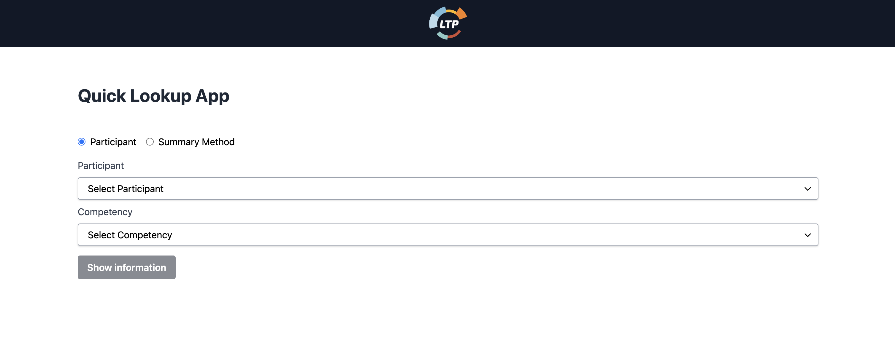

# Quick Lookup App 

This application is a Quick Lookup App designed to display information about participants' scores and various summary statistics.




## Table of Contents
- [Overview](#overview)
- [Features](#features)
- [Installation](#installation)
- [Usage](#usage)
- [Testing](#testing)

## Overview
The Quick Lookup App allows users to view participant scores and summary statistics based on various competencies. It fetches data from a JSON file (`scores.json`) and provides a user interface to select participants, competencies, and summary methods.

## Features
- View participant scores for specific competencies.
- Calculate summary statistics such as lowest score, highest score, average score, and type of data (score or level).
- User-friendly interface with dropdown menus and buttons.
- Responsive design for different screen sizes.

## Installation
1. Clone this repository:
    ```bash
    git clone <https://github.com/marwabahrini/Quick-Lookup-App>
    ```
2. Navigate to the project directory:
    ```bash
    cd quick-lookup-app
    ```
3. Install dependencies:
    ```bash
    npm install
    ```

## Usage
- Run the application:
    ```bash
    npm run dev
    ```
- Open your web browser and go to [http://localhost:3000](http://localhost:3000) to view the application.
- Select whether you want to view information for a participant or a summary method.
- Choose the participant or summary method from the dropdown menu.
- Select the competency you want to view or analyze.
- Click the "Show information" button to display the result.

## Testing
This project has been thoroughly tested using Jest and React Testing Library. Two types of tests have been implemented:
1. **Component Tests**: Tests have been written to ensure the proper rendering and behavior of key components within the application.
2. **Button Functionality Test**: Specific tests have been created to validate the functionality of the button, ensuring that it behaves as expected when clicked.
```bash
npm test
